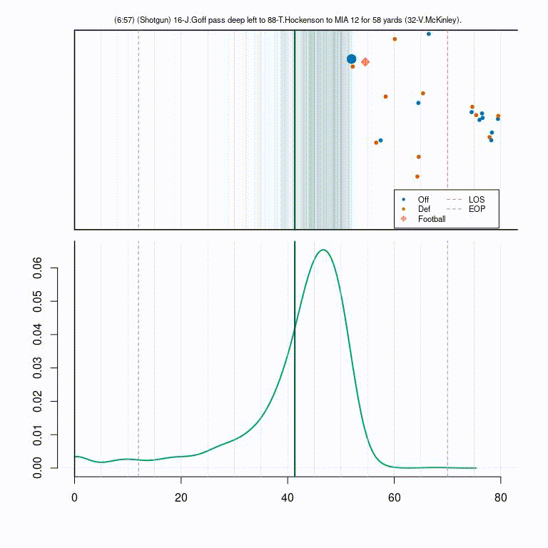

# PEP: A metric for evaluating tackles

This is the github repository for the corresponding submission to the
NFL Big Data Bowl 2024 competition on Kaggle. The original notebook can
be viewed
[here](https://www.kaggle.com/code/robbwu/pep-a-metric-for-evaluating-tackles).

## Quick Summary

In this contribution, we developed the metric PEP for quantifying the
value of tackles. It allows practitioners to assess players,
particularly in terms of their tackling abilities. Our approach allows
for within-play conditional density estimation of the end-of-play yard
line which serves as a basis for the evaluation of tackle performance
measured by prevented expected points by artificially removing the
tackler from the data. Importantly, our method incorporates
distributional information, i.e., heteroscedasticity and multimodality,
which would be lost when solely relying on point predictions. Therefore,
the uncertainty can propagate to the level of expected points, leading
to an accurate quantification of expected points prevented by the
tackle.

## Code Information

In the `prg` directory all necessary code to reproduce our work is
found. Due to size restriction, we are not able to upload our random
forest model for the conditional density estimation. The necessary
scripts for the random forest are the `preprocessing_new.R` and the
`train_eop_model_new.R` files. To calculate our PEP metric, the ep model
uploaded in the `models` folder can be used (the code from the
`ep_models.R` script can also be used to create your own model).
Finally, the `calc_tackle_value.R` file can be used to obtain PEP values
for each tackle.
