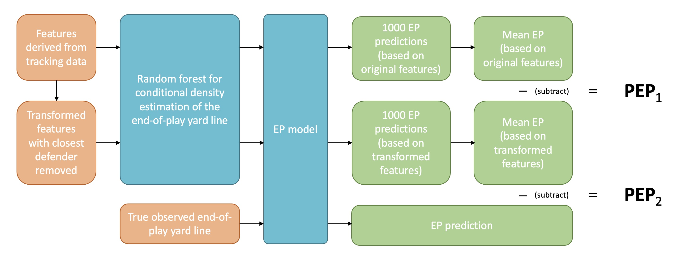

```{r setup, echo = FALSE, warning=FALSE, message=FALSE, include=FALSE}
knitr::opts_chunk$set(echo = TRUE)

library(tidyverse)
library(flextable)
library(ftExtra)
library(scales)
library(reactable)
library(reactablefmtr)
library(RCurl)
library(htmltools)
library(crosstalk)
library(ggridges)

pbp_data_bdb <- read.csv("data/plays.csv") %>% 
  mutate(uId = paste(gameId,playId,sep = "_"))

tackle_list <- readRDS("data/tackles_info_data_full_oos2.rds")

tackles <- tackle_list[[1]]
tackle_info_real2 <- tackle_list[[2]]
tackle_info_simple2 <- tackle_list[[3]]
tackle_pred_real <- tackle_list[[4]]
tackle_pred_s <- tackle_list[[5]]
tackle_vals <- tackle_list[[6]] 
best_tacklers <- tackle_list[[7]]

```

#### <span style="color: grey;"> Submission to metric track </span>


> "Football is two things. It's blocking and tackling."

> *Vince Lombardi*

## Introduction

Although this citation from one of the most successful head coaches in the history of the NFL dates back several decades --- and the sport of American Football has of course changed since then --- tackling remains an integral aspect of the game. In contrast to decision-making scenarios faced by players, such as a quarterback's selection of a target for a pass, the decision for a tackle is more straightforward: a defense player should always promptly tackle the ball carrier.

When assessing players' tackles, one is usually interested in a hypothetical scenario: the potential outcome if a player were to miss a tackle. 
Essentially, this involves quantifying the yards saved by a defensive player. Ideally, albeit impractically, running a play twice --- once with the defense player executing the tackle and a second time without --- would allow a direct comparison of the yardage gained by the ball carrier, thus enabling to evaluate the impact of the defensive player's tackle.

Given the impracticability of such a hypothetical scenario, our approach involves approximating it by predicting the yard line of the ongoing play twice. First, we consider the inclusion of the closest defender who executed the tackle (left panel of the below figure), and in a next step, we exclude this player (right panel of the below figure). However, only quantifying the yards saved by a particular tackle does not suffice as an adequate measure of tackle value, due to lack of interpretability on a scale truly relevant to the game outcome. Therefore, we aim to produce a measure of tackle value on the scale of expected points (EP). EP can be viewed as a complicated mapping of the end-of-play yard line to the expected points in the next play. A sole point prediction of the mean yard line misses uncertainty propagation to the EP scale, such that we aim to produce a full conditional density estimate to calculate the expected points from. The metric derived from this methodology then quantifies the *prevented expected points (PEP)*.

```{r plot_ex, fig.height=6, fig.width= 12, echo = FALSE}

coldens = "#009E73"
collos = "#CC79A7"
coleop = "#999999"
coloff = "#0072B2"
coldef = "#D55E00"

ex_play_r_vs_h <- readRDS("data/ex_play_vis_r_vs_h.rds")

tackle_frame <- ex_play_r_vs_h[[1]]
tackle_info <- ex_play_r_vs_h[[2]]
pred_r <- ex_play_r_vs_h[[3]]
pred_s <- ex_play_r_vs_h[[4]]

par(mfrow = c(1,2), oma = c(5,4,0,0) + 0.1, mar = c(0, 0, 0, 2) + 0.1)

########################
### plot fields, first real, then hyp

plot(tackle_frame$x_bc, tackle_frame$y_bc, pch = 1, lwd = 6, col = coloff, 
     xlim = c(0,min(round(max(tackle_frame$x_bc),-1)+30,100)), ylim = c(-53.3/2, 53.3/2+5), 
     xlab = "", ylab = "", bty = "n",xaxt = "n", yaxt = "n")
text(x=min(round(max(tackle_frame$x_bc),-1)+30,100)/2, y=53.3/2+2.5, "Real tackle frame", cex=1.5,font = 2) 
segments(x0 = 1:20 *5,
         y0 = 53.3/2,
         x1 = 1:20 *5,
         y1 = -53.3/2,
         col = "lightgray", lwd = 0.5)
segments(x0 = c(0,0),
         y0 = c(53.3/2,-53.3/2),
         x1 = c(100,100),
         y1 = c(53.3/2,-53.3/2),
         lwd = 1.5)

segments(x0 = tackle_info$yardline_100,
         y0 = 53.3/2,
         x1 = tackle_info$yardline_100,
         y1 = -53.3/2,
         col = collos,lty = 2)
#abline(v = tackle_info$yardline_100, col = "purple",lty = 2) # line of scrimmage

segments(x0 = 0,
         y0 = 53.3/2,
         x1 = 0,
         y1 = -53.3/2,
         lwd = 1.5)
#abline(v = 0, lwd = 1.5) # endzone

segments(x0 = tackle_info$true_yardline,
         y0 = 53.3/2,
         x1 = tackle_info$true_yardline,
         y1 = -53.3/2,
         col = "black", lty = 1, lwd = 2)

segments(x0 = tackle_info$true_yardline,
         y0 = tackle_frame$y_bc,
         x1 = tackle_frame$x_bc,
         y1 = tackle_frame$y_bc,
         lty = 2)
text(x = tackle_frame$x_bc+2,y = tackle_frame$y_bc-4,"yards to be gained", cex = 1, pos = 1)
arrows(tackle_frame$x_bc+2,tackle_frame$y_bc-4.5,
       tackle_frame$x_bc-4,tackle_frame$y_bc-0.5, angle = 20, length = 0.1, lwd = 1)

for(j in 2:11){
  points(tackle_frame[,paste0("x_or_off", j)], tackle_frame[, paste0("y_or_off", j)], pch = 20, col = coloff)
}
for(j in 2:11){
  points(tackle_frame[,paste0("x_or_def", j)], tackle_frame[, paste0("y_or_def", j)], pch = 20, col = coldef)
}
points(tackle_frame[,paste0("x_or_def", 1)], tackle_frame[, paste0("y_or_def", 1)], pch = 6, lwd = 3, col = coldef)

legend(x = 31, y = -21, bty = "n", lwd = 2, lty = 1, legend = c("true EOP yard line"))

plot(tackle_frame$x_bc, tackle_frame$y_bc, pch = 1, lwd = 6, col = coloff, 
     xlim = c(0,min(round(max(tackle_frame$x_bc),-1)+30,100)), ylim = c(-53.3/2, 53.3/2+5), 
     xlab = "", ylab = "", bty = "n",xaxt = "n", yaxt = "n")
text(x=min(round(max(tackle_frame$x_bc),-1)+30,100)/2, y=53.3/2+2.5, "Hypothetical tackle frame", cex=1.5,font = 2) 
segments(x0 = 1:20 *5,
         y0 = 53.3/2,
         x1 = 1:20 *5,
         y1 = -53.3/2,
         col = "lightgray", lwd = 0.5)
segments(x0 = c(0,0),
         y0 = c(53.3/2,-53.3/2),
         x1 = c(100,100),
         y1 = c(53.3/2,-53.3/2),
         lwd = 1.5)

segments(x0 = tackle_info$yardline_100,
         y0 = 53.3/2,
         x1 = tackle_info$yardline_100,
         y1 = -53.3/2,
         col = collos,lty = 2)
#abline(v = tackle_info$yardline_100, col = collos,lty = 2) # line of scrimmage

segments(x0 = 0,
         y0 = 53.3/2,
         x1 = 0,
         y1 = -53.3/2,
         lwd = 1.5)
#abline(v = 0, lwd = 1.5) # endzone

segments(x0 = 6,
         y0 = 53.3/2,
         x1 = 6,
         y1 = -53.3/2,
         col = coleop,lty = 2)
#text(x = 6, y = 0-10, "?",cex = 1.5,lwd = 2, pos = 4)

segments(x0 = 0,
         y0 = 53.3/2,
         x1 = 0,
         y1 = -53.3/2,
         col = coleop,lty = 2)
#text(x = 0, y = 0, "?",cex = 1.5,lwd = 2, pos = 4)

segments(x0 = 14,
         y0 = 53.3/2,
         x1 = 14,
         y1 = -53.3/2,
         col = coleop,lty = 2)
#text(x = 14, y = 0+15, "?",cex = 1.5,lwd = 2, pos = 4)

segments(x0 = 7,
         y0 = 53.3/2,
         x1 = 7,
         y1 = -53.3/2,
         col = coleop,lty = 2)

segments(x0 = 10,
         y0 = 53.3/2,
         x1 = 10,
         y1 = -53.3/2,
         col = coleop,lty = 2)

segments(x0 = 3,
         y0 = 53.3/2,
         x1 = 3,
         y1 = -53.3/2,
         col = coleop,lty = 2)

for(j in 2:11){
  points(tackle_frame[,paste0("x_or_off", j)], tackle_frame[, paste0("y_or_off", j)], pch = 20, col = coloff)
}
for(j in 1:10){
  points(tackle_frame[,paste0("x_or_def", j+1)], tackle_frame[, paste0("y_or_def", j+1)], pch = 20, col = coldef)
}

legend(x = 23, y = -21, bty = "n", lwd = 1, lty = 2, col = coleop, legend = c("hypothetical EOP yard lines"))
```

## Data

To accurately predict the yard line at the end of any given play it is necessary to create several features derived from the tracking data. More specifically, we conducted the following feature preprocessing:

#### Response variable: Yards to be gained
For each play, we define the x-position of the ball carrier in the last frame as the end-of-play yard line. The response variable we aim to predict is *yards to be gained*, defined as the difference of the x-position of the ball carrier in a given frame to the end-of-play yard line.

#### Feature engineering

For all players and the ball carrier we use the features already contained in the tracking data, namely x- and y-coordinates, speed, acceleration, distance covered, orientation and direction. Except for the ball carrier we further compute the euclidean distance, x-distance and y-distance to the ball carrier. For defensive players only, we additionally compute the absolute difference of the defender's direction and the angle of the shortest segment between the defender and the ball carrier. Subsequently, we order all players (in each frame) with respect to their euclidean distance to the ball carrier and standardize all features.

More details regarding data preprocessing can be found in the Appendix.

## Analysis

Our analysis comprises four steps:

#### 1. Model Training
We train a model designed to predict the *yards to be gained* from which we can calculate the end-of-play yard line (see Yurko et al., 2020). The model uses the previously described features, only including the ten closest defenders and should account for potential non-linear and interaction effects. The time-series nature of the data suggests the usage of deep learning architectures such as transformers or LSTMs which, however, lack uncertainty quantification. Though, here, modeling the uncertainty is important as the variance of the end-of-play yard line differs substantially between varying game situations. Thus, we set up a conditional density estimator $\hat{f}(y \mid x)$ and opt for a middle-ground solution between accuracy in mean prediction and uncertainty quantification and consider a random forest comprising 1000 individual trees.

Details on the training and testing procedure as well as model evaluation can be found in the Appendix.

#### 2. Tackler Replacement Procedure 
For each tackle, we systematically remove the closest defender at the moment of the tackle and replace the features with those of the second closest defender. Further on, we replace the second closest with the third closest, and so on. In this way, we come up with a prediction for a hypothetical "what if the tackle would be missed" scenario which then can be compared to the real existing tackle.

#### 3. Yard Line Prediction 
Using the trained random forest, we predict the end-of-play yard line with 1000 trees. Using a kernel density estimator for visualization, we can plot the dynamically evolving conditional density estimate within any given play.

For the purpose of illustration, we present a specific example play. The video below shows a successful passing play from the Detroit Lions against the Miami Dolphins. After a completed pass, the ball carrier (in this case tight end T.J. Hockenson) is able to gain a substantial amount of yards by evading a tackle and is finally stopped at the 12-yard line.

<center>
<video width="600" height="400" controls>
  <source src="play_mov.mp4" type="video/mp4">
</video>
</center>

Below we display an animation of that same play (in the transformed coordinate system). At each frame, we add the conditional density of the *yards to be gained* from our model. There are a few observations: First, at the beginning of the play the density is concentrated, because the model expects a tackle from the closest defender. As soon as T.J. Hockenson is able to evade the first tackle, the density changes. The distribution's variance increases and we even observe bimodality with a lot of mass at the endzone. Finally, at the time of tackle the distribution narrows again, as we expect the runner to make only a few more yards.

```{r animation, fig.show='animate', ffmpeg.format='gif', dev='jpeg', echo = FALSE,fig.width= 8,fig.height=8,fig.align='center',interval = 0.4}
library(scales)

coldens = "#009E73"
collos = "#CC79A7"
coleop = "#999999"
coloff = "#0072B2"
coldef = "#D55E00"

ex_play <- readRDS("data/example_play_for_anim3.rds")
gpId <- ex_play[[1]]
tracking_play <- ex_play[[2]]
play_train <- ex_play[[3]]
pred <- ex_play[[4]]
pbp_info <- ex_play[[5]]


par(mfrow = c(2,1), oma = c(5,4,0,0) + 0.1, mar = c(0, 0, 0, 2) + 0.1)
for(i in 1:(nrow(pred)-7)){
  plot(tracking_play$x_bc[i], tracking_play$y_bc[i], pch = 1, lwd = 6, col = coloff, 
       xlim = c(0,min(round(max(tracking_play$x_bc),-1)+30,100)), ylim = c(-53.3/2, 53.3/2+5), 
       xlab = "", ylab = "", bty = "n",xaxt = "n", yaxt = "n")
  text(x=min(round(max(tracking_play$x_bc),-1)+30,100)/2, y=53.3/2+2.5, pbp_info$desc, cex=.7)
  segments(x0 = 1:20 *5,
           y0 = 53.3/2,
           x1 = 1:20 *5,
           y1 = -53.3/2,
           col = "lightgray", lwd = 0.5)
  segments(x0 = c(0,0),
           y0 = c(53.3/2,-53.3/2),
           x1 = c(100,100),
           y1 = c(53.3/2,-53.3/2),
           lwd = 1.5)
  
  segments(x0 = pbp_info$yardline_100,
           y0 = 53.3/2,
           x1 = pbp_info$yardline_100,
           y1 = -53.3/2,
           col = collos,lty = 2)
  #abline(v = tackle_info$yardline_100, col = collos,lty = 2) # line of scrimmage
  
  segments(x0 = 0,
           y0 = 53.3/2,
           x1 = 0,
           y1 = -53.3/2,
           lwd = 1.5)
  #abline(v = 0, lwd = 1.5) # endzone
  
  segments(x0 = pbp_info$true_yardline,
           y0 = 53.3/2,
           x1 = pbp_info$true_yardline,
           y1 = -53.3/2,
           col = coleop,lty = 2)
  
  # plot predicted yard end yard line
  for(j in 1:1000){
    segments(x0 = max(tracking_play$x_bc[i]-pred[i,j],0),
             y0 = 53.3/2,
             x1 = max(tracking_play$x_bc[i]-pred[i,j],0),
             y1 = -53.3/2,
             lwd = 2, col = alpha(coldens, 0.01))
    #abline(v = tackle_frame$x_bc-pred_r[j], lwd = 2, col = alpha(coldens, 0.01))
  }
  segments(x0 = max(tracking_play$x_bc[i] - mean(pred[i,]),0),
           y0 = 53.3/2,
           x1 = max(tracking_play$x_bc[i] - mean(pred[i,]),0),
           y1 = -53.3/2,
           col = 1, lwd = 2)
  #abline(v = tackle_frame$x_bc - mean(pred_r), col = 1, lwd = 2) # expected eop yardline
  segments(x0 = max(tracking_play$x_bc[i] - mean(pred[i,]),0),
           y0 = 53.3/2,
           x1 = max(tracking_play$x_bc[i] - mean(pred[i,]),0),
           y1 = -53.3/2,
           col = coldens, lwd = 1)
  #abline(v = tackle_frame$x_bc - mean(pred_r), col = coldens, lwd = 1) # expected eop yardline
  
  points(tracking_play$x_bc[i], tracking_play$y_bc[i], pch = 1, lwd = 6, col = coloff)
  points(tracking_play$x_bc[i], tracking_play$y_bc[i], pch = 16, col = coloff)
  
  for(j in 2:11){
    points(tracking_play[i,paste0("x_or_off", j)], tracking_play[i, paste0("y_or_off", j)], pch = 20, col = coloff)
  }
  for(j in 1:11){
    points(tracking_play[i,paste0("x_or_def", j)], tracking_play[i, paste0("y_or_def", j)], pch = 20, col = coldef)
  }
  points(tracking_play$x_football[i], tracking_play$y_football[i], pch = 9, col = "coral1", lwd = 2)
  legend(x = pbp_info$yardline_100-10, y = -16,
         legend = c("Off","Def","Football","LOS","EOP"),
         col = c(coloff,coldef,"coral1",collos,coleop),
         pch = c(20,20,9,NA,NA), lty = c(NA,NA,NA,2,2),
         cex = 0.7, ncol = 2,bg = "white") 
  
  plot(density(pmax(tracking_play$x_bc[i]-pred[i,],0), bw = 2.5,from = 0), 
       col = coldens, lwd = 2, xlim = c(0,min(round(max(tracking_play$x_bc),-1)+30,100)), bty = "n", main = "", xlab = "eop yardline")
  abline(v = 1:20 *5, col = "lightgray", lwd = 0.5)
  abline(v = pbp_info$yardline_100, col = collos,lty = 2)
  abline(v = 0, lwd = 1.5) # endzone
  abline(v = max(tracking_play$x_bc[i] - mean(pred[i,]),0), col = 1, lwd = 2)
  abline(v = max(tracking_play$x_bc[i] - mean(pred[i,]),0), col = coldens, lwd = 1)
  abline(v = pbp_info$true_yardline, col = coleop,lty = 2)
  
  #Sys.sleep(0.1)
}

```

For the tackle frames in particular, we obtain one predictive density, based on the original features, and one based on the replacement procedure explained above.

```{r plot_new1, fig.height=10, fig.width= 12, echo = FALSE}

ex_play_r_vs_h <- readRDS("data/ex_play_vis_r_vs_h.rds")

tackle_frame <- ex_play_r_vs_h[[1]]
tackle_info <- ex_play_r_vs_h[[2]]
pred_r <- ex_play_r_vs_h[[3]]
pred_s <- ex_play_r_vs_h[[4]]

vis_tackle_plays3 <- function(gpId,
                              coldens = "chartreuse1",
                              collos = "purple",
                              coleop = "darkgreen",
                              coloff = "blue",
                              coldef = "red"){
  
  par(mfrow = c(2,2), oma = c(5,4,0,0) + 0.1, mar = c(0, 0, 0, 2) + 0.1)
  
  ########################
  ### plot fields, first real, then hyp
  
  plot(tackle_frame$x_bc, tackle_frame$y_bc, pch = 1, lwd = 6, col = coloff, 
       xlim = c(0,min(round(max(tackle_frame$x_bc),-1)+30,100)), ylim = c(-53.3/2, 53.3/2+5), 
       xlab = "", ylab = "", bty = "n",xaxt = "n", yaxt = "n")
  text(x=min(round(max(tackle_frame$x_bc),-1)+30,100)/2, y=53.3/2+2.5, "Real tackle frame", cex=1.5,font = 2) 
  segments(x0 = 1:20 *5,
           y0 = 53.3/2,
           x1 = 1:20 *5,
           y1 = -53.3/2,
           col = "lightgray", lwd = 0.5)
  segments(x0 = c(0,0),
           y0 = c(53.3/2,-53.3/2),
           x1 = c(100,100),
           y1 = c(53.3/2,-53.3/2),
           lwd = 1.5)
  
  segments(x0 = tackle_info$yardline_100,
           y0 = 53.3/2,
           x1 = tackle_info$yardline_100,
           y1 = -53.3/2,
           col = collos,lty = 2)
  #abline(v = tackle_info$yardline_100, col = "purple",lty = 2) # line of scrimmage
  
  segments(x0 = 0,
           y0 = 53.3/2,
           x1 = 0,
           y1 = -53.3/2,
           lwd = 1.5)
  #abline(v = 0, lwd = 1.5) # endzone
  
  segments(x0 = tackle_info$true_yardline,
           y0 = 53.3/2,
           x1 = tackle_info$true_yardline,
           y1 = -53.3/2,
           col = coleop,lty = 2)
  
  # plot predicted yard end yard line
  for(j in 1:1000){
    segments(x0 = max(tackle_frame$x_bc-pred_r[j],0),
             y0 = 53.3/2,
             x1 = max(tackle_frame$x_bc-pred_r[j],0),
             y1 = -53.3/2,
             lwd = 2, col = alpha(coldens, 0.01))
    #abline(v = tackle_frame$x_bc-pred_r[j], lwd = 2, col = alpha(coldens, 0.01))
  }
  segments(x0 = max(tackle_frame$x_bc - mean(pred_r),0),
           y0 = 53.3/2,
           x1 = max(tackle_frame$x_bc - mean(pred_r),0),
           y1 = -53.3/2,
           col = 1, lwd = 2)
  #abline(v = tackle_frame$x_bc - mean(pred_r), col = 1, lwd = 2) # expected eop yardline
  segments(x0 = max(tackle_frame$x_bc - mean(pred_r),0),
           y0 = 53.3/2,
           x1 = max(tackle_frame$x_bc - mean(pred_r),0),
           y1 = -53.3/2,
           col = coldens, lwd = 1)
  #abline(v = tackle_frame$x_bc - mean(pred_r), col = coldens, lwd = 1) # expected eop yardline
  
  points(tackle_frame$x_bc, tackle_frame$y_bc, pch = 1, lwd = 6, col = coloff)
  points(tackle_frame$x_bc, tackle_frame$y_bc, pch = 16, col = coloff)
  
  for(j in 2:11){
    points(tackle_frame[,paste0("x_or_off", j)], tackle_frame[, paste0("y_or_off", j)], pch = 20, col = coloff)
  }
  for(j in 2:11){
    points(tackle_frame[,paste0("x_or_def", j)], tackle_frame[, paste0("y_or_def", j)], pch = 20, col = coldef)
  }
  points(tackle_frame[,paste0("x_or_def", 1)], tackle_frame[, paste0("y_or_def", 1)], pch = 6, lwd = 3, col = coldef)
  #points(trackingsub$x_football[i], trackingsub$y_football[i], pch = 9, col = "coral1", lwd = 2)
  
  ### hypothetical frame
  
  plot(tackle_frame$x_bc, tackle_frame$y_bc, pch = 1, lwd = 6, col = coloff, 
       xlim = c(0,min(round(max(tackle_frame$x_bc),-1)+30,100)), ylim = c(-53.3/2, 53.3/2+5), 
       xlab = "", ylab = "", bty = "n",xaxt = "n", yaxt = "n")
  text(x=min(round(max(tackle_frame$x_bc),-1)+30,100)/2, y=53.3/2+2.5, "Hypothetical tackle frame", cex=1.5,font = 2) 
  segments(x0 = 1:20 *5,
           y0 = 53.3/2,
           x1 = 1:20 *5,
           y1 = -53.3/2,
           col = "lightgray", lwd = 0.5)
  segments(x0 = c(0,0),
           y0 = c(53.3/2,-53.3/2),
           x1 = c(100,100),
           y1 = c(53.3/2,-53.3/2),
           lwd = 1.5)
  
  segments(x0 = tackle_info$yardline_100,
           y0 = 53.3/2,
           x1 = tackle_info$yardline_100,
           y1 = -53.3/2,
           col = collos,lty = 2)
  #abline(v = tackle_info$yardline_100, col = collos,lty = 2) # line of scrimmage
  
  segments(x0 = 0,
           y0 = 53.3/2,
           x1 = 0,
           y1 = -53.3/2,
           lwd = 1.5)
  #abline(v = 0, lwd = 1.5) # endzone
  
  segments(x0 = tackle_info$true_yardline,
           y0 = 53.3/2,
           x1 = tackle_info$true_yardline,
           y1 = -53.3/2,
           col = coleop,lty = 2)
  
  # plot predicted yard end yard line
  for(j in 1:1000){
    segments(x0 = max(tackle_frame$x_bc-pred_s[j],0),
             y0 = 53.3/2,
             x1 = max(tackle_frame$x_bc-pred_s[j],0),
             y1 = -53.3/2,
             lwd = 2, col = alpha(coldens, 0.01))
    #abline(v = tackle_frame$x_bc-pred_s[j], lwd = 2, col = alpha(coldens, 0.01))
  }
  segments(x0 = max(tackle_frame$x_bc - mean(pred_s),0),
           y0 = 53.3/2,
           x1 = max(tackle_frame$x_bc - mean(pred_s),0),
           y1 = -53.3/2,
           col = 1, lwd = 2)
  #abline(v = tackle_frame$x_bc - mean(pred_s), col = 1, lwd = 2) # expected eop yardline
  segments(x0 = max(tackle_frame$x_bc - mean(pred_s),0),
           y0 = 53.3/2,
           x1 = max(tackle_frame$x_bc - mean(pred_s),0),
           y1 = -53.3/2,
           col = coldens, lwd = 1)
  #abline(v = tackle_frame$x_bc - mean(pred_s), col = coldens, lwd = 1) # expected eop yardline
  
  points(tackle_frame$x_bc, tackle_frame$y_bc, pch = 1, lwd = 6, col = coloff)
  points(tackle_frame$x_bc, tackle_frame$y_bc, pch = 16, col = coloff)
  
  for(j in 2:11){
    points(tackle_frame[,paste0("x_or_off", j)], tackle_frame[, paste0("y_or_off", j)], pch = 20, col = coloff)
  }
  for(j in 1:10){
    points(tackle_frame[,paste0("x_or_def", j+1)], tackle_frame[, paste0("y_or_def", j+1)], pch = 20, col = coldef)
  }
  #points(trackingsub$x_football[i], trackingsub$y_football[i], pch = 9, col = "coral1", lwd = 2)
  
  ########################
  ### density lines: first real, then hypothetical
  
  plot(density(pmax(tackle_frame$x_bc-pred_r,0), bw = 2.5,from = 0), 
       col = coldens, lwd = 2, xlim = c(0,min(round(max(tackle_frame$x_bc),-1)+30,100)), bty = "n", main = "", xlab = "eop yardline")
  abline(v = 1:20 *5, col = "lightgray", lwd = 0.5)
  abline(v = tackle_info$yardline_100, col = collos,lty = 2)
  abline(v = 0, lwd = 1.5) # endzone
  abline(v = tackle_frame$x_bc - mean(pred_r), col = 1, lwd = 2)
  abline(v = tackle_frame$x_bc - mean(pred_r), col = coldens, lwd = 1)
  abline(v = tackle_info$true_yardline, col = coleop,lty = 2)
  
  
  
  
  plot(density(pmax(tackle_frame$x_bc-pred_s,0), bw = 2.5,from = 0), 
       col = coldens, lwd = 2, xlim = c(0,min(round(max(tackle_frame$x_bc),-1)+30,100)), bty = "n", main = "", xlab = "eop yardline")
  abline(v = 1:20 *5, col = "lightgray", lwd = 0.5)
  abline(v = tackle_info$yardline_100, col = collos,lty = 2)
  abline(v = 0, lwd = 1.5) # endzone
  abline(v = tackle_frame$x_bc - mean(pred_s), col = 1, lwd = 2)
  abline(v = tackle_frame$x_bc - mean(pred_s), col = coldens, lwd = 1)
  abline(v = tackle_info$true_yardline, col = coleop,lty = 2)
  
}

gpId <- 2022103003480

coldens = "#009E73"
collos = "#CC79A7"
coleop = "#999999"
coloff = "#0072B2"
coldef = "#D55E00"

vis_tackle_plays3(gpId,coldens,collos,coleop,coloff,coldef)

```

#### 4. Tackle Evaluation 
<!-- We set up an own EP model (similar to nflfastR, ...) and calculate the EPs for all 1000 predictions and average the outcomes (because of integral calculations, Monte Carlo approximation).  -->
<!-- Es gibt zwei Möglichkeiten (echte + expected mit full player) einen Tackle Value zu berechnen, wir nehmen Möglichkeit 2  -->
<!-- This process yields the tackle's value *PEP* (for prevented Expected Points) with the respective tackler excluded from the data set.  -->

<!-- Causal inference Ansatz, aber auf g(y) also EP Ebene. -->
From a mathematical perspective, we want to obtain the mean expected points, given the conditional distribution of the end-of-play yard line produced by our random forest. More formally, letting the mapping $g$ represent the calculation of expected points based on the end-of-play yard line $Y$ we are interested in

$$
\text{E}(g(Y) \mid x) = \int g(y) \: \hat{f} (y \mid x) \: dy
$$
For the mapping $g$ we set up our own EP model based on an XGBoost architecture (Chen and Guestrin, 2016) which, after model training, can be used to calculate the expected points. In essence, we follow the implementation of the EP model from the nflfastR package (Carl and Baldwin, 2023). However, we have to derive all features used in the model solely from the predicted *yards to be gained* of each play which makes using the model from the nflfastR package impractical. As features for our model we employ the yard line of the play (adjusted LOS), yards to go, down, quarter, a home team indicator and timeouts remaining for each team (we omit features such as half seconds remaining, which are not extractable from the predicted *yards to be gained*).

Instead of a two-step procedure, first obtaining a kernel density estimate from the individual tree predictions (introducing subjectivity in bandwidth choice) and then integrating numerically, we treat the tree-predictions $\hat{y}_1, \dots, \hat{y}_{1000}$ as samples from the conditional density and approximate the above expectation via the Monte Carlo estimate
$$
\frac{1}{1000} \sum_{i=1}^{1000} g(\hat{y}_i).
$$

A metric for quantifying tackle value can now be obtained in two ways. First, the hypothetical mean expected points can be compared to the mean expected points based on the predicted conditional density using the original features, i.e.,
$$
\text{PEP}_1 = \text{E}(g(Y) \mid x_{removed}) - \text{E}(g(Y) \mid x_0),
$$
where $x_{removed}$ denotes the transformed features after removing the closest defender and $x_0$ denotes the original features. Second, the latter term can be replaced by the expected points based on true observed end-of-play yard line $y_0$, as
$$
\text{PEP}_2 = \text{E}(g(Y) \mid x_{removed}) - g(y_0).
$$

$\text{PEP}_1$ is similar to what is regarded a treatment effect in the literature representing the average expected points prevented by the tackle, given the specific game situation. In contrast, $\text{PEP}_2$ quantifies the prevented expected points by a real observed tackle. This is relevant for, e.g., player evaluation as some players might over- or underperform in comparison to the model prediction.

The below figure summarizes the above steps. 

```{r overview, fig.align = 'center', fig.cap = "Graphical overview of the steps of our analysis.", warning=FALSE, message=FALSE,echo = FALSE}

```

## Player evaluation

In this section we evaluate the *PEP* values at a player level. In particular, we calculate for each player his cumulative $\text{PEP}_1$ and $\text{PEP}_2$ and display these together with the average $\text{PEP}_1$ and $\text{PEP}_2$ per tackle. To get a reliable average for these, we set the minimum number of tackles to ten. Users are then invited to compare players by selecting different teams and clicking on different positions.

```{r players, echo = FALSE, warning=FALSE, message=FALSE}

make_pal <- function(value,col_low = "red",col_middle = "skyblue",col_high = "darkgreen",nq = 10){
  colourer <- col_quantile(
    palette = c(col_low,col_middle,col_high),
    domain = c(min(value), max(value)),
    n = nq)
  rev(names(table(colourer(value))))
}

make_pal2 <- function(value,col_low = "red",col_middle = "skyblue",col_high = "darkgreen",nq = 10){
  colourer <- col_quantile(
    palette = c(col_low,col_middle,col_high),
    domain = c(min(value), max(value)),
    n = nq)
  colourer(value)
}

best_tacklers <- best_tacklers %>% 
  mutate(position = if_else(position == "MLB","ILB",position))

best_tacklers_u <- best_tacklers %>% filter(n_tackles >= 10,position != "DB") %>% 
  mutate(col1 = make_pal2(sum_tackle_gains),
         col2 = make_pal2(sum_tackle_gains2),
         col3 = make_pal2(avg_per_tackle),
         col4 = make_pal2(avg_per_tackle2))


data <- best_tacklers %>% select(displayName,club,url,position,n_tackles,
                           sum_tackle_gains,sum_tackle_gains2,
                           avg_per_tackle,avg_per_tackle2) %>%
  filter(n_tackles >= 10,position != "DB")

crosstalk_data <- SharedData$new(data)

#url.logo <- getURL("https://raw.githubusercontent.com/statsbylopez/BlogPosts/master/nfl_teamlogos.csv")
#df.logos <- read.csv(text = url.logo)

#best_tacklers <- best_tacklers %>%
#  left_join(df.logos , by = c("club" = "team_code"))


position_filter <- filter_checkbox(
  id = "pos",
  label = "Position",
  sharedData = crosstalk_data,
  group = ~ position,
  inline = TRUE
)

team_filter <- filter_select(
  id = "team",
  label = "TEAM",
  sharedData = crosstalk_data,
  group = ~ club,
)


n_tackles_filter <- filter_slider(
  id = "n_tackles",
  label = "Number of tackles",
  sharedData = crosstalk_data,
  column = ~ n_tackles,
  ticks = TRUE,
  dragRange = FALSE,
  step = 1,
  width = "50%"
)

tbl <- reactable(crosstalk_data,
  bordered = TRUE,
  defaultSorted = "sum_tackle_gains2",
  defaultSortOrder = "desc",
  
  columns = list(
    displayName = colDef(
      name = "Name"
    ),
    club = colDef(
      name = "Team"
    ),
    url = colDef(
      name = "Team Logo",
      maxWidth = 70,
      align = "center",
      cell = embed_img(height = 25, width = 40)
    ),
    position = colDef(
      name = "Position"
    ),
    n_tackles = colDef(
      name = "# Tackles",
      maxWidth = 80
    ),
    sum_tackle_gains = colDef(
      name = "Sum PEP[1]",
      format = colFormat(digits = 2),
      style = color_scales(best_tacklers_u, color_ref = "col1"),
      maxWidth = 80
    ),
    sum_tackle_gains2 = colDef(
      name = "Sum PEP[2]",
      format = colFormat(digits = 2),
      style = color_scales(best_tacklers_u, color_ref = "col2"),
      maxWidth = 80
    ),
    avg_per_tackle = colDef(
      name = "Avg PEP[1]",
      format = colFormat(digits = 2),
      style = color_scales(best_tacklers_u, color_ref = "col3"),
      maxWidth = 80
    ),
    avg_per_tackle2 = colDef(
      name = "Avg PEP[2]",
      format = colFormat(digits = 2),
      style = color_scales(best_tacklers_u, color_ref = "col4"),
      maxWidth = 80
    )
  )
  
)

div(bscols(
  widths = c(4, NA,NA),
    list(position_filter,
         team_filter,
         n_tackles_filter))
)

### display table
div(tbl)

```

When comparing players in the above table across different positions, it quickly becomes apparent that, for example, defensive tackles do not have similar *PEP* values to safeties. So we want to compare the cumulative $\text{PEP}_2$ of players at the same position with players at other positions. In doing so, we can see in the lower left density plot that some positions, as already indicated above, turn out to be low *PEP* positions. This is mainly due to the fact that defensive ends, nose tackles or defensive tackles are protected by linebackers, safeties and cornerbacks. On the other hand, inside linebackers have the highest *PEP* values as those players tackle the most. Comparing the average *PEP* per position in the bottom right density plot, we can see that inside linebackers fall in the order of importance and are overtaken by cornerbacks and safeties. This can be explained by considering that they are often the last to tackle before the opposing players gain many yards or even score a touchdown.  

```{r pos, fig.height=6, fig.width= 10, echo = FALSE, warning=FALSE, message=FALSE}

library(ggpubr)

pos_df <- best_tacklers %>% 
  group_by(position) %>% 
  summarise(avg = mean(sum_tackle_gains),
            avg2 = mean(sum_tackle_gains2),
            avg3 = mean(avg_per_tackle2),
            avg_n_tackles = mean(n_tackles),
            n_players = n()) %>% 
  arrange(desc(avg2)) %>% 
  filter(position != "DB" )

myorder <- pos_df %>% pull(position)

best_tacklers_plot <- best_tacklers %>%
  filter(position != "DB") %>%
  mutate(position = factor(position, levels = rev(myorder)))

colourer <- col_quantile(
  palette = c("red","skyblue","darkgreen"),
  domain = c(min(pos_df$avg2), max(pos_df$avg2)),
  n = 10)

p1 <- ggplot(
  best_tacklers_plot, 
  aes(x = sum_tackle_gains2, y = position,fill = position)
) +
  scale_fill_manual(values = alpha(rev(c("#006400", "#327B3B", "#327B3B", "#4E926C", "#66AA9D", "#D0A19E", "#FF0000", "#FF0000", "#FF0000"))),0.2) +
  stat_density_ridges(quantile_lines=TRUE,
                      quantile_fun=function(x,...)c(mean(x)))+
  theme_minimal()+
  theme(legend.position = "none")+
  xlab("PEP")+
  labs(title = 'Distribution of sum of PEP[2] values per position')

myorder2 <- pos_df %>% arrange(desc(avg3)) %>% pull(position)

best_tacklers_plot2 <- best_tacklers %>%
  filter(position != "DB") %>%
  mutate(position = factor(position, levels = rev(myorder2)))

p2 <- ggplot(
  best_tacklers_plot2, 
  aes(x = avg_per_tackle2, y = position,fill = position)
) +
  scale_fill_manual(values = alpha(rev(c("#006400", "#327B3B", "#327B3B", "#4E926C", "#66AA9D", "#D0A19E", "#FF0000", "#FF0000", "#FF0000"))),0.2) +
  stat_density_ridges(quantile_lines=TRUE,
                      quantile_fun=function(x,...)c(mean(x)))+
  theme_minimal()+
  theme(legend.position = "none")+
  xlab("PEP")+
  xlim(-0.5,1.5)+
  labs(title = 'Distribution of avg of PEP[2] values per position')

ggarrange(p1,p2,ncol = 2,nrow = 1)

```

## Discussion
In this contribution, we developed the metric *PEP* for quantifying the value of tackles. It allows practitioners to assess players, particularly in terms of their tackling abilities. Our approach allows for within-play conditional density estimation of the end-of-play yard line which serves as a bases for the evaluation of tackle performance measured by *prevented expected points* by artificially removing the tackler from the data. Importantly, our method incorporates distributional information, i.e., heteroscedasticity and multimodality, which would be lost when solely relying on point predictions. Therefore, the uncertainty can propagate to the level of expected points, leading to an accurate quantification of expected points prevented by the tackle.

However, there are some drawbacks that need to be taken into account during the evaluation process. One important consideration is the defensive playing style of teams. We have already seen that cornerbacks and safeties are often more likely to make "touchdown-saving tackles", so their scores tend to be higher. If safeties are also involved in riskier defensive strategies (e.g., in a Brian Flores defence) and therefore receive less support from their teammates in the backfield, their values could increase even more. 

Another area for future research is defensive turnovers. We neglected these plays in our analysis because their specific outcome was not compatible with our current EP model. In general, however, tackles that lead to defensive turnovers are valuable plays, for which players who often tackle *and* force the ball loose for a fumble (such as Haason Reddick) should be rewarded with extra-positive values. 

Furthermore, the metric can potentially be used to evaluate offensive player performances. In particular, our models could identify efficient ball carriers who do not lose many EPs by being tackled.

In summary, the metrics we have developed can serve as an additional piece of the puzzle in the overall evaluation of (defensive) players, and may gain practical relevance in the process of scouting players and opponents.

## Code

All code for data preprocessing, model training, prediction and player evaluation can be found [here](https://github.com/Rob2208/nfl_bdb_24).

## References

* Carl S, Baldwin B (2023). nflfastR: Functions to Efficiently Access NFL Play by Play Data. R package version 4.6.0.9000, https://github.com/nflverse/nflfastR, https://www.nflfastr.com/.
* Chen, T., & Guestrin, C. (2016). XGBoost: A scalable tree boosting system. In Proceedings of the 22nd acm sigkdd international conference on knowledge discovery and data mining (pp. 785-794).
* Yurko, R., Matano, F., Richardson, L. F., Granered, N., Pospisil, T., Pelechrinis, K., & Ventura, S. L. (2020). Going deep: models for continuous-time within-play valuation of game outcomes in American football with tracking data. Journal of Quantitative Analysis in Sports, 16(2), 163-182.

## Appendix

#### Data preprocessing & feature engeneering

Prior to more involved feature engeneering steps, we transform the coordinate system by i) redefining the x-variable as the x-distance to the endzone (such that all play directions are from right to left and the relevant endzone is at zero), ii) centering the y-variable such that the center of the field is at zero and iii) changing the direction variable, such that zero degrees represents heading straight towards the corresponding endzone.

For the identification of tackle events we consider the frame in which the distance of the tackler (whom we derive from the tackle event data set) to the ball carrier is minimal within a given play. 

As we evaluate tackles by comparing a hypothetical outcome to the true end-of-play yard line, it is not reasonable to include every tackle play for the final evaluation. We exclude all plays with penalties, as this affects the final yard line of the play. Furthermore, we currently also remove tackle plays which led to defensive turnovers as well as plays where the discrepancy between forward progress and final position of the ball carrier is large (> 2 yards). Although tackles made in such plays may be valuable, our framework is at the moment not able to handle them appropriately. 

#### Model training & evaluation

Considering memory restrictions we conduct the following training and test procedure: We train one model on the data of weeks one to four resulting in an RMSE of 5.864 and MAE of 3.212 when predicting weeks five to nine. To check for robustness and to obtain an out-of-bag prediction for every tackle, we train a second model on weeks seven to nine. We evaluate this model on weeks one to six, yielding an RMSE of 5.931 and MAE of 3.210. Due to the similarity in model performance, it is evident that a subset of the full data set already allows for sufficient stability.


